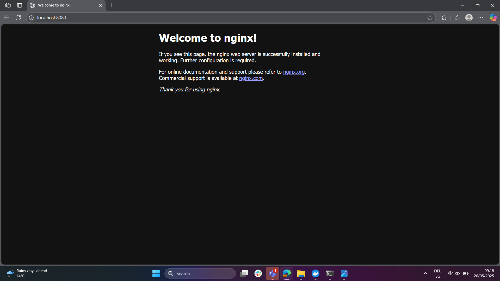
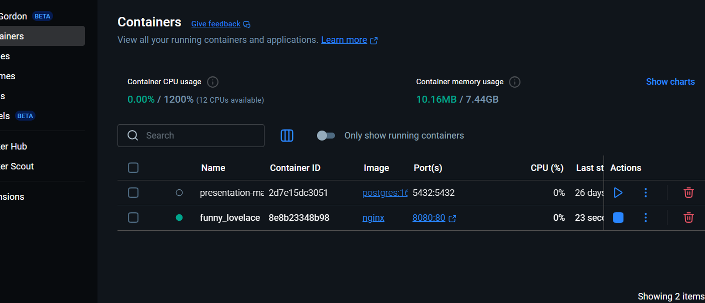

# A) Installation

# B) Docker Command Line Interface (CLI)
## 1. Check the Docker version. Which command do you need to use for this?
For checking thh docker version we need to use the following command: docker --version
## 2. Look for the two official Docker images, ubuntu and nginx, on Docker Hub using the command. You will use both of themdocker search
## 3. In Part A, you had to execute the command. Explain the different parameters.docker run -d -p 80:80 docker/getting-started
This command runs a docker container on detached mode(-d), that means that it runs on the background. Then it maps the computers port 80 to the container's port 80 (-p 80:80) and the docker/getting-started is the image used to launch an app to test Docker.
## 4. Take a screenshot of the default page of nginx with the URL visible.
## 5. With the ubuntu image, proceed as follows. We show that not every image can run in the background. 
### 1. Create and launch a container using the . Comment You will find out what will happen to the container in 3-5 sentences. was the image downloaded automatically? Could it start?docker run -d
### 2. Create and launch a container using the . Comment You what happens now in 3-5 sentences.docker run -it
## 6. Make sure your nginx container is already running. Now open an interactive shell afterwards. The difference from before is that you don't start the container with an interactive shell, but open a shell of a running container. The command is docker exec -it <name-ihres-container> /bin/bash
### 1. Run the command. Take a screenshot of the command and the result. You can see that you can move around within the Docker image.service nginx status
### 2. Exit the interactive shell in the Docker container (using the command). Note that the image terminates automatically.exit

## 7. Check the status of the containers. Take a screenshot of the command and the result.
## 8. Now stop the container of the nginx image with the corresponding Docker command
## 9. Remove all previous containers using the appropriate Docker command. Of course, you don't have to delete your own and company containers.
So the proper command to delete ALL containers would be 'docker container prune' which wouldn't delete the ones running. But since i don't want to delete my companies docker containers i'll use 'docker rm (container id)' since it'll target the only ones i want using their id.
## 10. Remove the two images from your local environment using the appropriate Docker command
