### 1. What IP addresses did busybox1, busybox2, busybox3 and busybox4 obtain? You can also solve this task withdocker inspect

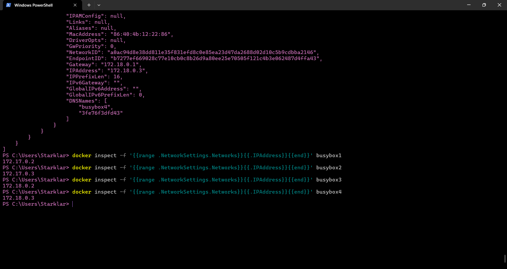
##### Explanation of command docker inspect -f '{{range .NetworkSettings.Networks}}{{.IPAddress}}{{end}}' busybox1
The part of the command that is 'docker inspect' does exactly what it says it inspect containers, yet it appeared a lot of information so i wanted to only receive only the IP Adress so i specified it.The part '-f '{{...}}'' lets me format the output using Go templating instead of dumping the full JSON. Then {{range .NetworkSettings.Networks}} loops through all networks the container is connected to. Then {{.IPAddress}} makes that for each network, it fetches the IP address assigned to the container in that network. And last but not least {{end}} ends the loop as well says.
### 2. Start an interactive session on busybox1 and enter the following commands, or find the correct commands: 
##### 1. Which default gateway is entered? Which container has the same?
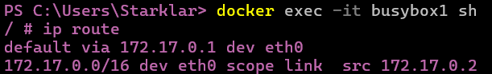
##### 2. ping busybox2
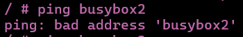
This one was supposed to work but on the default bridge, we cannot use container names like busybox2 to ping we need to use IP Adresses.
##### 3. ping busybox3
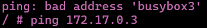
##### 4. ping IP-by-busybox2
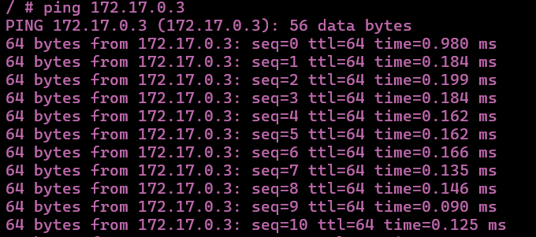
##### 5. ping IP-from-busybox3
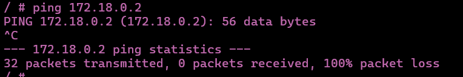

### 3. Start an interactive session on busybox3 and enter the following commands: 
##### 1. Which default gateway is entered? Which container has the same?
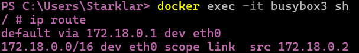
##### 2. ping busybox1
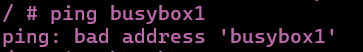
##### 3. ping busybox4
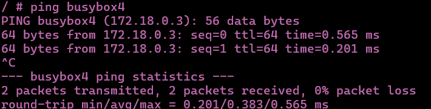
##### 4. ping IP-from-busybox1
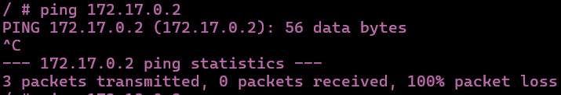
##### 5. ping IP-from-busybox4
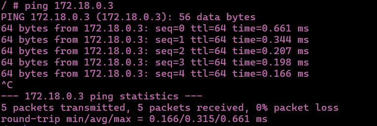

### Explain the similarities and differences. How do the conditions come about and what is your conclusion.
  - Default bridge containers (busybox1 & 2), can communicate only with each other if use the IP Adress and it uses the subnet 172.17.0.0/16 by default.

  - Custom network 'tbz' containers (busybox3 & 4), can communicate freely with each other which means we can use the names of the containers to ping them and uses the subnet 172.18.0.0/16 which was defined by us.

  - Between networks, the ping command fails between containers on different networks (default ↔ tbz). The reason id that Docker isolates networks unless you link or bridge them explicitly.
### Now consider KN02. 
##### In which network were the two containers located?
They were most probably in the default bridge.
##### How could they talk to each other?
They would be able to communicate if they were in the same network, or we were to define a custom user-defined bridge (like tbz) that allows automatic DNS resolution by container name.
