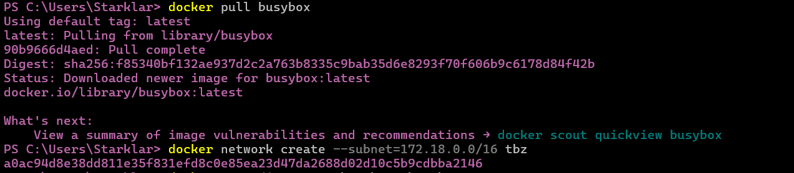
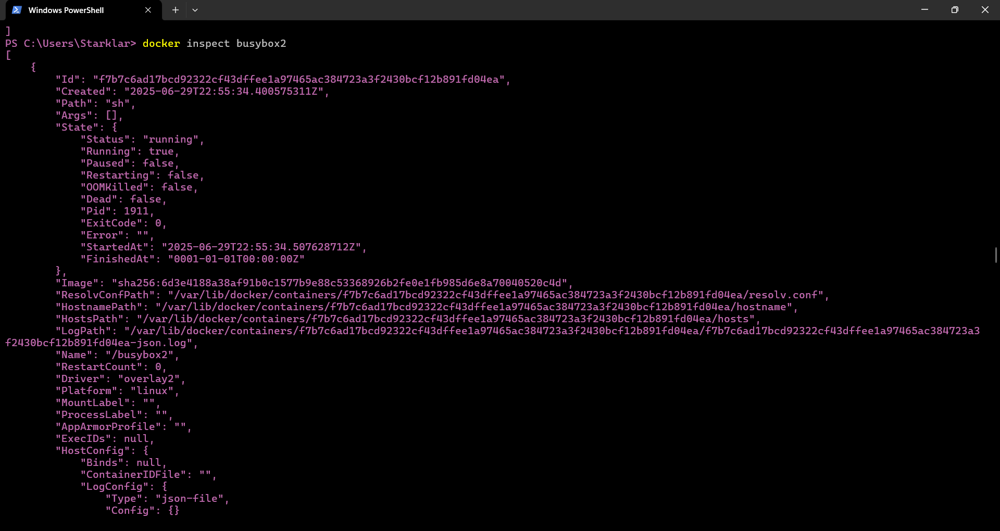
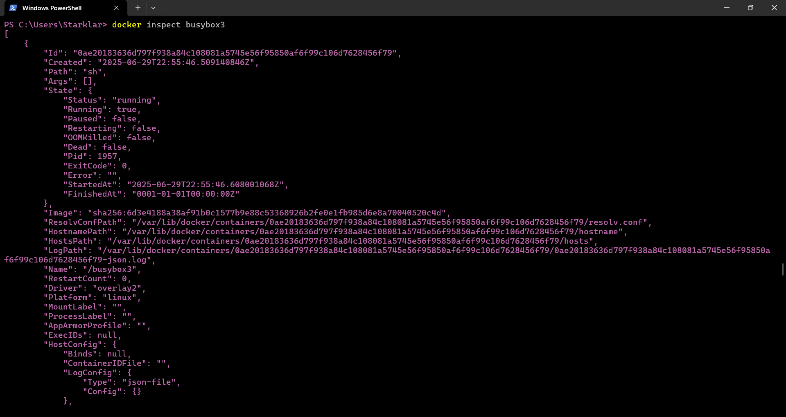
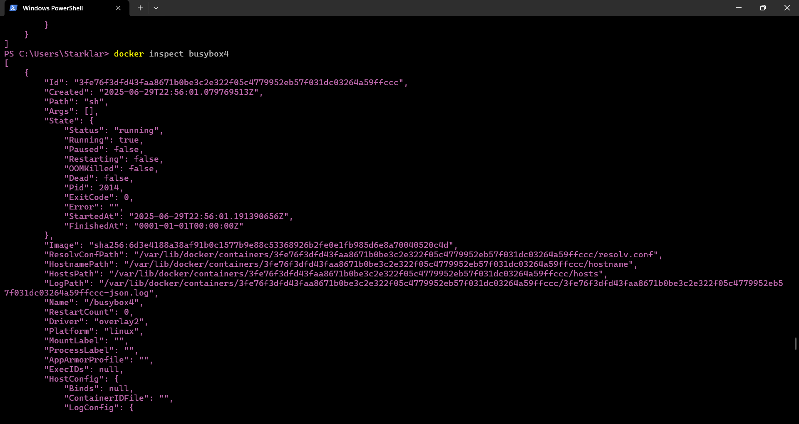

### 1. What IP addresses did busybox1, busybox2, busybox3 and busybox4 obtain? You can also solve this task withdocker inspect

Ip Adresses:"172.17.0.2"

Ip Adresses:"172.17.0.3"

Ip Adresses:"172.18.0.2"

Ip Adresses:"172.18.0.3"
### 2. Start an interactive session on busybox1 and enter the following commands, or find the correct commands: 
##### 1. Which default gateway is entered? Which container has the same?
##### 2. ping busybox2
##### 3. ping busybox3
##### 4. ping IP-by-busybox2
##### 5. ping IP-from-busybox3

### 3. Start an interactive session on busybox3 and enter the following commands: 
##### 1. Which default gateway is entered? Which container has the same?
##### 2. ping busybox1
##### 3. ping busybox4
##### 4. ping IP-from-busybox1
##### 5. ping IP-from-busybox4
