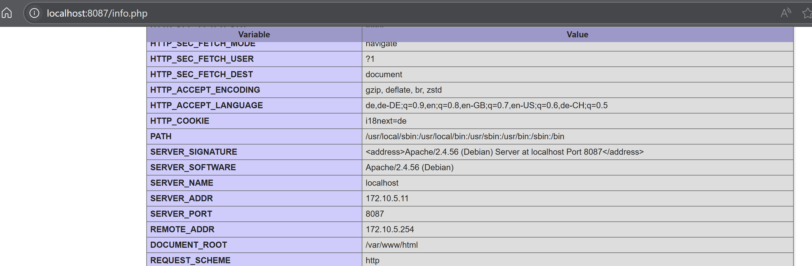
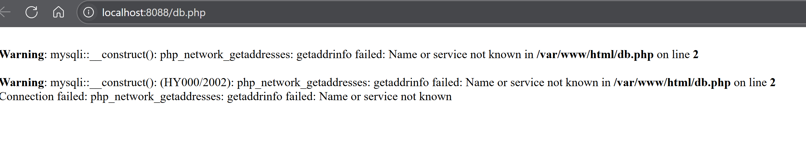
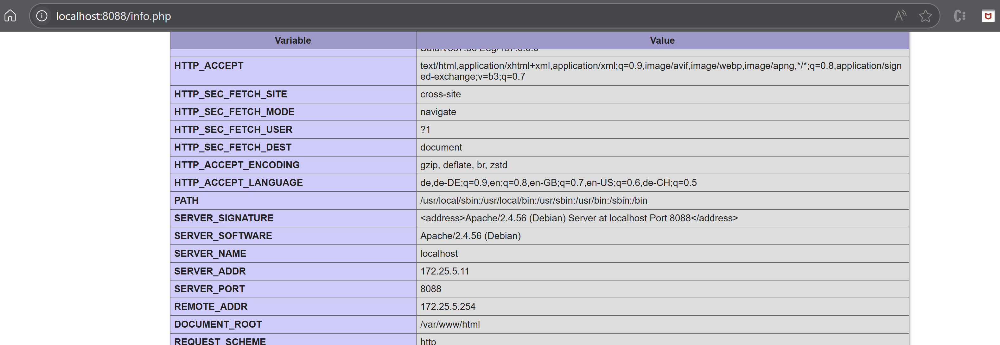

## A




| Befehl                  | Erklärung                                                                 |
|-------------------------|---------------------------------------------------------------------------|
| docker build            | Baut das Web-Image lokal anhand des Dockerfile                            |
| docker network create   | Erstellt das benutzerdefinierte Netzwerk                                  |
| docker volume create    | Erstellt ggf. Volumes für DB-Persistenz (nicht direkt in dieser Aufgabe) |
| docker run              | Startet beide Container mit Namen und Konfiguration                       |
| docker logs             | Wird verwendet, um Logs zu verfolgen, falls Fehler auftreten              |
| docker ps               | Zeigt die laufenden Container (implizit sichtbar nach Start)              |

## B




the issue on the db page is caused by this line in the db.php file:

```
new mysqli("kn02b-db", "root", "root", "kn02");
```
In this Docker Compose setup, there is no service or container named kn02b-db, so Docker's internal DNS cannot resolve it. As a result, PHP shows a php_network_getaddresses error, because it can't find the database host.
This happens because the web image was built earlier, when kn02b-db was the correct hostname. Now in the new Compose file, the service has a new name, but the old db.php file inside the image still tries to reach kn02b-db.

its easily fixed by changing `kn02b-db` to whatever the correct name is and re-building the image.
