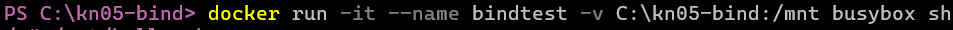
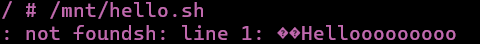
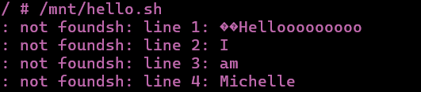
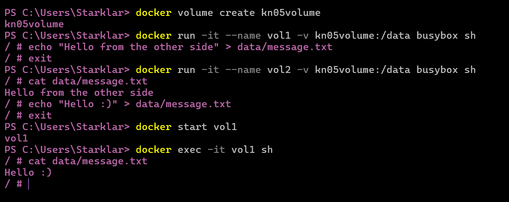
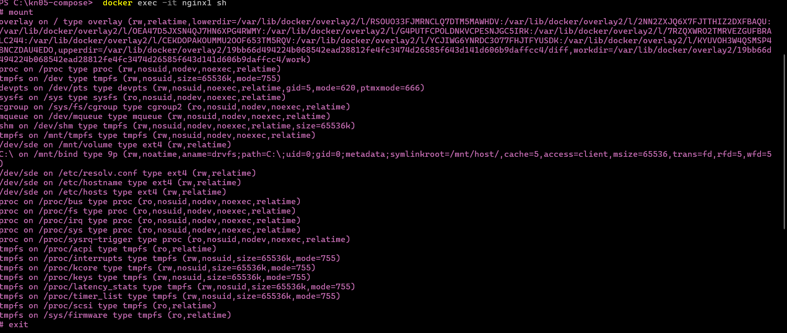
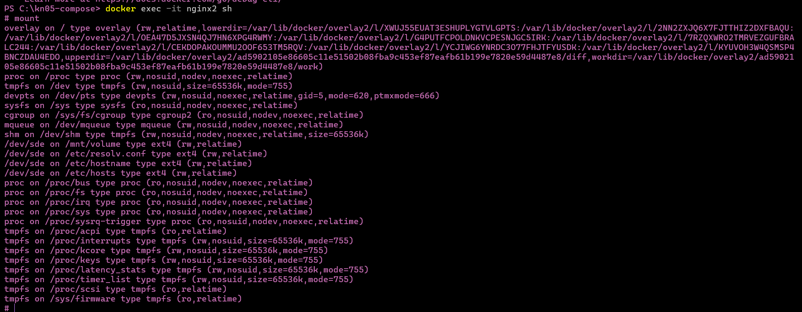

# A) Bind mounts
#### The comands i used for this part of the exercise was the following:
- 
- to go to the directory i created for this task
- 
- with this comand i created the file hello.sh and the content was Hellooooooooo
- 
- This commands makes docker to start a new container and open it in interactive mode with terminal,
  the conatiner's name is bindtest. Then it takes my windows folder C:\kn05-bind and mounts it into
  the container at the path /mnt. We use the image busybox and we start the container with shell (sh)
- 
- Then this runs the script hello.sh that’s in my folder C:\kn05-bind, but it's accessed inside the container at /mnt/hello.sh. Then i change it
  i change the file hello.sh manually and save it.
- 
- Once saved i just run this command again to run the file/display the content

- Note: i tried to screencast this process like 5 times but it always cut without saving the video just when i open the file to edit it. Therefore the video provided is the aftermath.
- IMPORTANT: Video provided in the screencast folder.
# B) Volumes

#### docker volume create kn05volume
Creates a named volume called kn05volume.
#### docker run -it --name vol1 -v kn05volume:/data busybox sh | docker run -it --name vol2 -v kn05volume:/data busybox sh
Starts a container named vol1/vol2 using the BusyBox image.
#### echo "Hello from the other side" > /data/message.txt
This command creates a file inside the volume (/data/message.txt) and writes:Hello from the other side
#### exit
I left the BusyBox shell and stop the container session.
#### cat /data/message.txt
Displays the content of message.txt
#### docker start vol1
I restarted the first container (vol1) which was previously exited.
#### docker exec -it vol1 sh
I opened a new shell session inside the now-running vol1 container.
#### cat /data/message.txt
Prints the content of the file again, now showing: Hello :). Which i rewrote previously.
- IMPORTANT: Video provided in the screencast folder.

#C) Memory with docker compose

- IMPORTANT: Video provided in the screencast folder.
